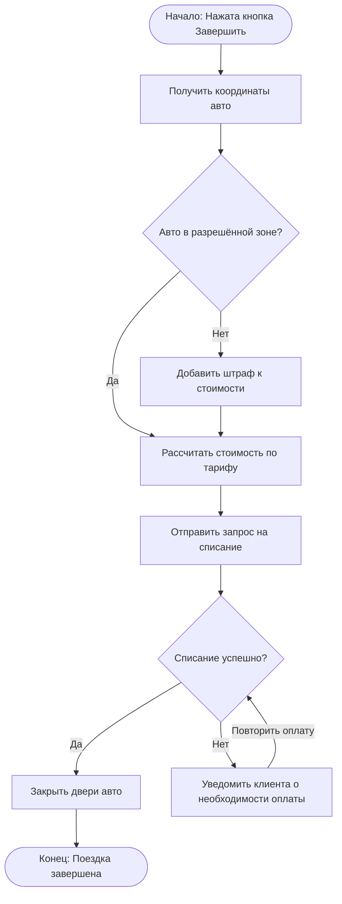

# Flowchart: Алгоритм завершения аренды и расчёта стоимости

```mermaid
flowchart TD
    A([Начало: Нажата кнопка Завершить]) --> B[Получить координаты авто]
    B --> C{Авто в разрешённой зоне?}
    
    C -- Да --> D[Рассчитать стоимость по тарифу]
    C -- Нет --> E[Добавить штраф к стоимости]
    E --> D
    
    D --> F[Отправить запрос на списание]
    F --> G{Списание успешно?}
    
    G -- Да --> H[Закрыть двери авто]
    G -- Нет --> I[Уведомить клиента о необходимости оплаты]
    I -- Повторить оплату --> G{Списание успешно?}
    
    H --> J([Конец: Поездка завершена])
```
%% minor update
