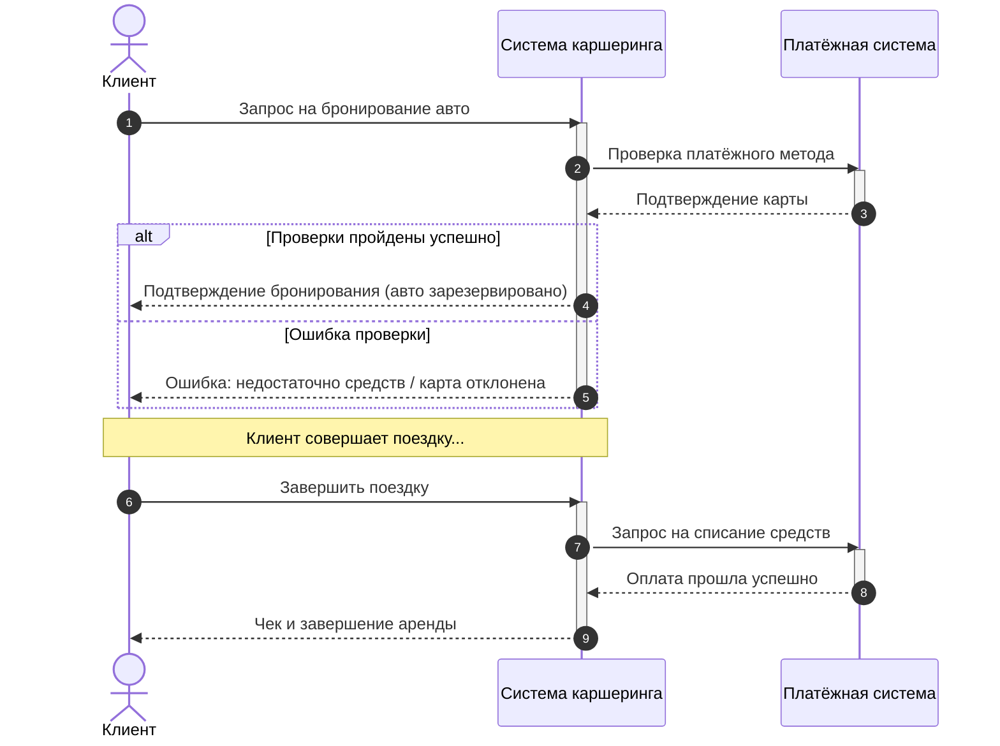

# Sequence Diagram: Взаимодействие при бронировании и оплате

```mermaid
sequenceDiagram
    autonumber
    actor Client as Клиент
    participant App as Система каршеринга
    participant Pay as Платёжная система

    Client->>App: Запрос на бронирование авто
    activate App
    App->>Pay: Проверка платёжного метода
    activate Pay
    Pay-->>App: Подтверждение карты
    deactivate Pay

    alt Проверки пройдены успешно
        App-->>Client: Подтверждение бронирования (авто зарезервировано)
    else Ошибка проверки
        App-->>Client: Ошибка: недостаточно средств / карта отклонена
    end
    deactivate App

    Note over Client, App: Клиент совершает поездку...

    Client->>App: Завершить поездку
    activate App
    App->>Pay: Запрос на списание средств
    activate Pay
    Pay-->>App: Оплата прошла успешно
    deactivate Pay
    App-->>Client: Чек и завершение аренды
    deactivate App
```