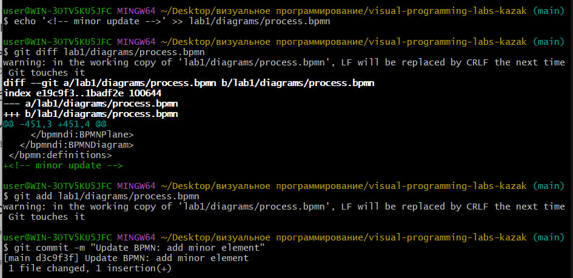

# Отчёт по лабораторной работе №1
**Тема:** Моделирование процессов с использованием Git и визуальных нотаций  
**Процесс:** Аренда автомобиля в сервисе каршеринга  

## 1. Описание процесса
Процесс охватывает полный цикл аренды автомобиля: от авторизации пользователя и бронирования с параллельными проверками до завершения поездки, проверки геозоны, расчета стоимости и списания средств.

## 2. Диаграммы процесса
- **BPMN:** `diagrams/process-bpmn.png`
- **UML Activity:** `diagrams/activity-uml.png`
- **Sequence Diagram:** `docs/sequence.md`
- **Flowchart:** `docs/flowchart.md`

## 3. Сравнение версионирования (Git Diff)
При внесении изменений в файлы нотаций:
- Текстовые форматы (XML в `.bpmn`, Mermaid в `.md`) позволяют отслеживать точные изменения по строкам через `git diff`.
- Бинарные форматы (`.png`) отображаются в Git как полностью изменившийся файл без деталей внутри.

## 4. Внесение изменения и демонстрация diff

## 5. Выводы
В ходе работы был настроен Git-репозиторий и освоены 4 нотации моделирования процессов. Текстовые нотации и стандартизированные форматы (Mermaid, BPMN XML) значительно удобнее при командной разработке, так как позволяют детально отслеживать историю изменений.
