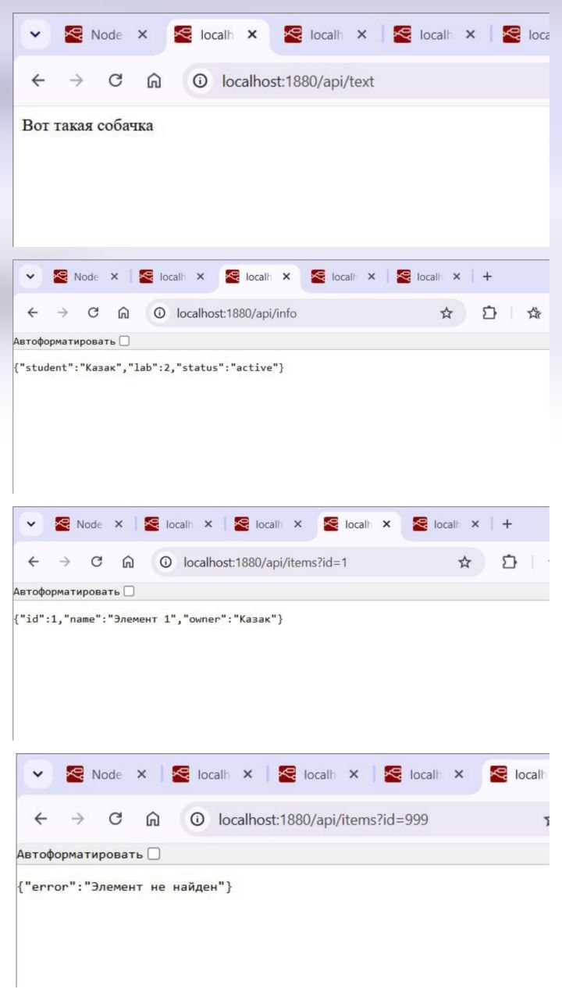

# Документация API

Лабораторная работа №2 · студент: Казак Ульяна

## Общие сведения

| Параметр | Значение |
|---|---|
| Базовый URL | `http://localhost:1880` |
| Префикс API | `/api` |
| Метод | `GET` (для всех эндпоинтов) |
| Формат ответов | `text` (для `/api/text`), `JSON` (для остальных) |
| Кодировка | UTF-8 |
| Аутентификация | Не требуется |

## Список эндпоинтов

| Метод | Путь | Параметры | Описание | Формат ответа |
|---|---|---|---|---|
| GET | `/api/text` | — | Возвращает текстовое сообщение | text |
| GET | `/api/info` | — | Информация о студенте и статусе работы | JSON |
| GET | `/api/items` | `id` (query) | Возвращает элемент по идентификатору | JSON |

---

## 1. GET `/api/text`

Возвращает простую текстовую строку.

**Параметры:** отсутствуют.

**Пример запроса**

```http
GET /api/text HTTP/1.1
Host: localhost:1880
```

```bash
curl http://localhost:1880/api/text
```

**Успешный ответ** — `200 OK`

```text
Вот такая собачка
```

**Ошибки:** не предусмотрены.

---

## 2. GET `/api/info`

Возвращает JSON-объект с информацией о студенте, номере лабораторной работы и статусе.

**Параметры:** отсутствуют.

**Пример запроса**

```http
GET /api/info HTTP/1.1
Host: localhost:1880
```

```bash
curl http://localhost:1880/api/info
```

**Успешный ответ** — `200 OK`

```json
{
  "student": "Казак",
  "lab": 2,
  "status": "active"
}
```

**Поля ответа**

| Поле | Тип | Описание |
|---|---|---|
| `student` | string | Фамилия студента |
| `lab` | number | Номер лабораторной работы |
| `status` | string | Текущий статус (`active`) |

**Ошибки:** не предусмотрены.

---

## 3. GET `/api/items`

Возвращает один элемент по его идентификатору.

**Параметры запроса (query)**

| Параметр | Тип | Обязательный | Описание | Пример |
|---|---|---|---|---|
| `id` | number | да | Идентификатор элемента | `1` |

### 3.1. Успешный запрос — элемент найден

**Пример запроса**

```http
GET /api/items?id=1 HTTP/1.1
Host: localhost:1880
```

```bash
curl "http://localhost:1880/api/items?id=1"
```

**Ответ** — `200 OK`

```json
{
  "id": 1,
  "name": "Элемент 1",
  "owner": "Казак"
}
```

**Поля ответа**

| Поле | Тип | Описание |
|---|---|---|
| `id` | number | Идентификатор элемента |
| `name` | string | Название элемента |
| `owner` | string | Владелец элемента |

### 3.2. Ошибка — элемент не найден

Возникает, если элемента с указанным `id` не существует.

**Пример запроса**

```http
GET /api/items?id=999 HTTP/1.1
Host: localhost:1880
```

```bash
curl -i "http://localhost:1880/api/items?id=999"
```

**Ответ** — `404 Not Found` *(код статуса на скриншоте не виден; при необходимости уточните по вкладке Network в браузере)*

```json
{
  "error": "Элемент не найден"
}
```

**Поля ответа**

| Поле | Тип | Описание |
|---|---|---|
| `error` | string | Текст сообщения об ошибке |

---

## Сводная таблица ответов

| Запрос | Статус | Тело ответа |
|---|---|---|
| `GET /api/text` | 200 | `Вот такая собачка` |
| `GET /api/info` | 200 | `{"student":"Казак","lab":2,"status":"active"}` |
| `GET /api/items?id=1` | 200 | `{"id":1,"name":"Элемент 1","owner":"Казак"}` |
| `GET /api/items?id=999` | 404 | `{"error":"Элемент не найден"}` |

## Скриншоты

