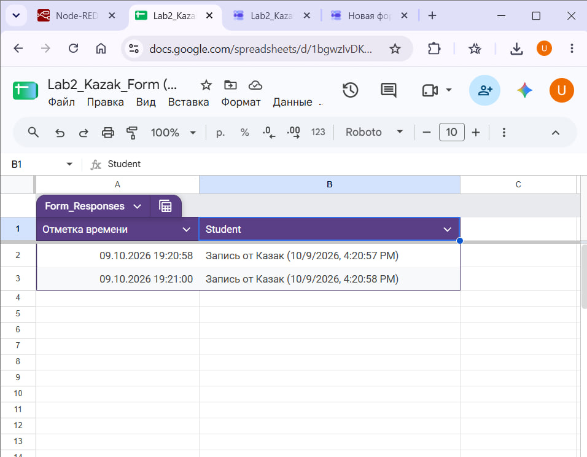
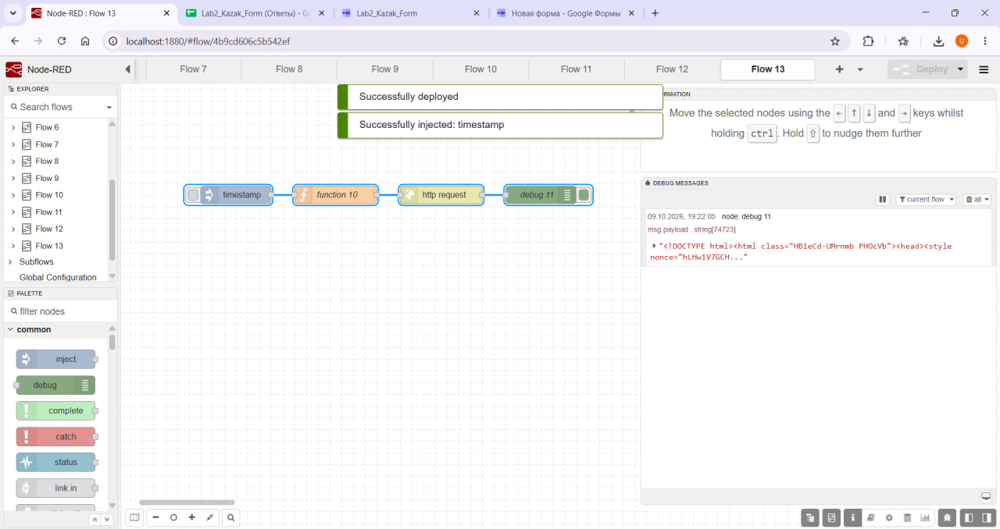

# Отчет по лабораторной работе №2: Node-RED


| **Студент** | Казак Ульяна |


---

## 1. Краткое описание выполненного

В ходе лабораторной работы был освоен инструмент low-code разработки **Node-RED**. Были созданы и задеплоены **12 основных потоков данных**, охватывающих работу с:

- таймерами;
- функциями JavaScript;
- ветвлением (`Switch`);
- изменением сообщений (`Change`);
- шаблонами (`Template`);
- HTTP-запросами;
- MQTT-брокером;
- дашбордами;
- Telegram-ботом;
- файловым вводом-выводом;
- контекстом.

Дополнительно была успешно выполнена **ачивка** по интеграции Node-RED с Google Формами и Google Таблицами.

---

## 2. Способ установки, версии Node-RED и Node.js

| Параметр | Значение |
|---|---|
| Способ установки | Docker Desktop (WSL2), образ `nodered/node-red:latest`, контейнер `nodered`, проброс порта `1880:1880`, данные хранятся в именованном томе Docker `node_red_data`, смонтированном в `/data` |
| Версия Node-RED | v5.0.8 |
| Версия Node.js | v24.21.0 |
| ОС контейнера | Linux (ядро 6.18.40.1-microsoft-standard-WSL2, x64) |
| Каталог данных | `/data` (файл потоков `/data/flows.json`, настройки `/data/settings.js`) |
| Адрес редактора | `http://127.0.0.1:1880/` |

---

## 3. Освоенные ноды

| Категория | Ноды |
|---|---|
| Базовые | `inject`, `debug`, `function`, `switch`, `change` |
| Шаблоны и веб | `template`, `http in`, `http response`, `http request` |
| IoT и внешние сервисы | `mqtt in`, `mqtt out`, `telegram receiver`, `telegram sender`, Google Forms API |
| Интерфейс и хранение | `ui_gauge`, `ui_chart` (Dashboard), `file in`, `file out` |

---

## 4. Примеры использованных AI-промптов

При разработке потоков и отладке использовались следующие ключевые запросы к ИИ:

1. > Напиши код для function node на JavaScript, который принимает число в msg.payload, проверяет его через if/else, использует массив и цикл for, и возвращает результат в msg.payload.
2. > Как правильно отправить HTTP POST-запрос из Node-RED на эндпоинт Google Forms (formResponse) с заголовком application/x-www-form-urlencoded и передать entry ID?
3. > Помоги составить структуру API-документации для GET-эндпоинтов с query-параметрами и ответами в формате JSON.

---

## 5. Скриншоты Flow и Дашборда

Все скриншоты потоков, эндпоинтов и дашборда сохранены в структуре репозитория:

| № | Файл | Описание |
|---|---|---|
| 1 | `lab2/screenshots/01-inject-debug.png` | Flow 1 — Inject & Debug |
| 2 | `lab2/screenshots/02-function.png` | Flow 2 — Function |
| 3 | `lab2/screenshots/03-switch.png` | Flow 3 — Switch |
| 4 | `lab2/screenshots/04-change.png` | Flow 4 — Change |
| 5 | `lab2/screenshots/05-template.png` | Flow 5 — Template |
| 6 | `lab2/screenshots/06-http-request.png` | Flow 6 — HTTP Request |
| 7 | `lab2/screenshots/07-mqtt.png` | Flow 7 — MQTT HiveMQ |
| 8 | `lab2/screenshots/08-endpoints.png` | Flow 8 — GET Endpoints |
| 9 | `lab2/screenshots/09-dashboard.png` | Flow 9 — UI Dashboard |
| 10 | `lab2/screenshots/10-telegram.png` | Flow 10 — Telegram Bot |
| 11 | `lab2/screenshots/11-files.png` | Flow 11 — File I/O |
| 12 | `lab2/screenshots/12-context.png` | Flow 12 — Context variables |
| 15 | `lab2/screenshots/15-google-sheets.png` | Ачивка 15 — Google Forms / Sheets |

---

## 6. Документация API (Flow 8)

Описание GET-эндпоинтов (`/api/text`, `/api/info`, `/api/items?id=…`), параметров, примеров запросов и ответов, включая ошибки, приведено в отдельном файле [`API.md`](API.md).

---

## 7. Интеграция с Google Forms / Sheets (Ачивка 15)

| Параметр | Значение |
|---|---|
| Метод | `POST` |
| Эндпоинт отправки | `https://docs.google.com/forms/d/e/1FAIpQLSeWEsgCmOR39wSfW7w2r55gpuW-PytSL3ilW5iicI5zH-REbw/formResponse` |
| Content-Type | `application/x-www-form-urlencoded` |

**Тело запроса (payload):**

```text
entry.757185635=Запись от Казак (...)
```
 
**Скриншоты:**
 

 

 
---

## 8. Выводы

Лабораторная работа позволила на практике закрепить навыки визуального программирования в среде Node-RED. Были изучены:

- механизмы обработки сообщений с помощью JavaScript-функций;
- принципы маршрутизации потоков;
- организация взаимодействия по протоколу MQTT с публичными брокерами;
- построение пользовательских веб-интерфейсов через Dashboard;
- создание Telegram-ботов;
- файловый ввод-вывод и работа с контекстом выполнения.

Контейнеризация через Docker обеспечила изолированность и стабильность среды разработки.
